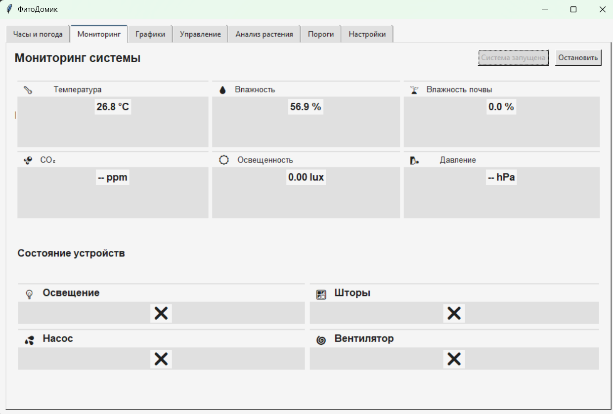
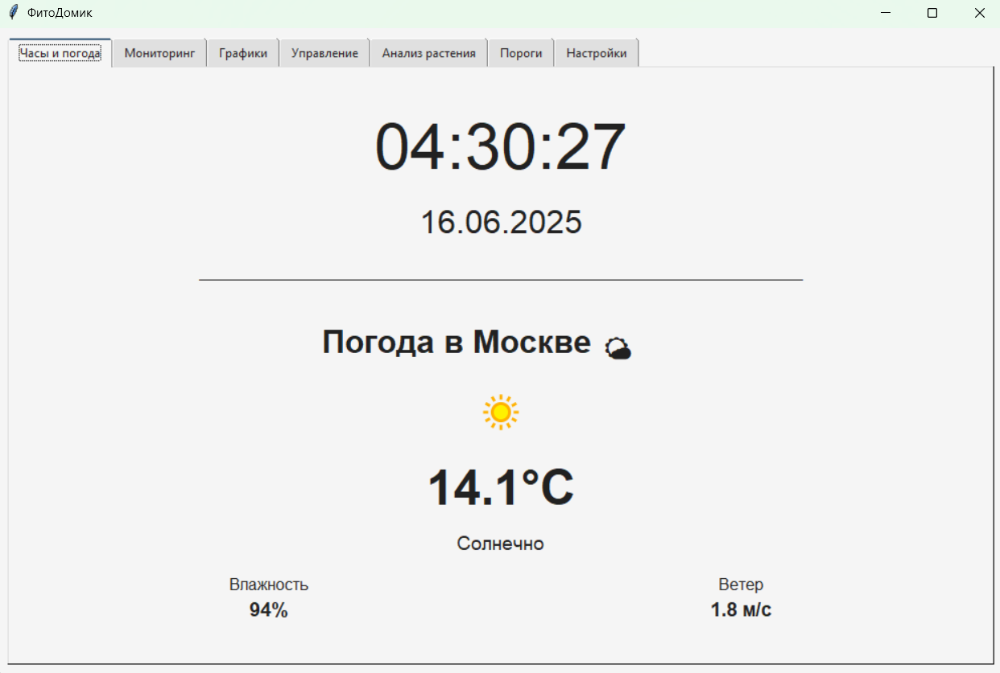
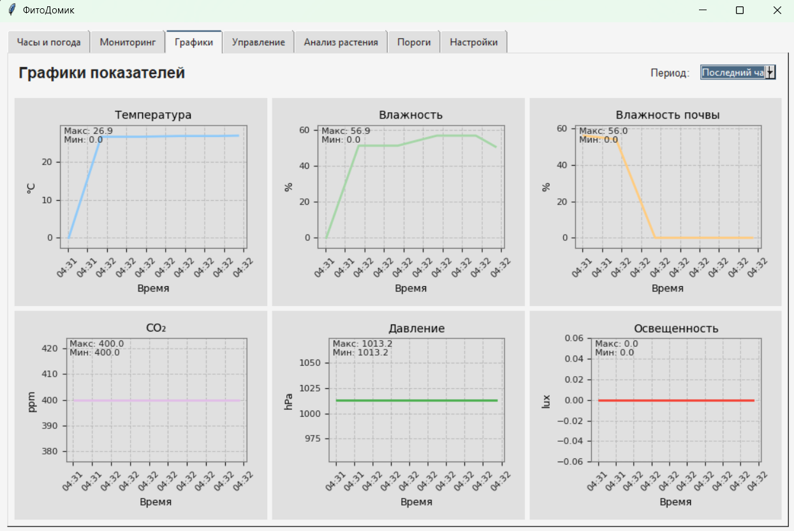
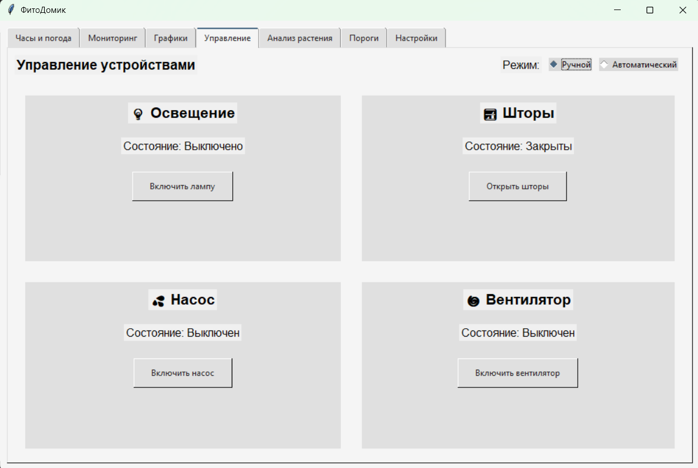
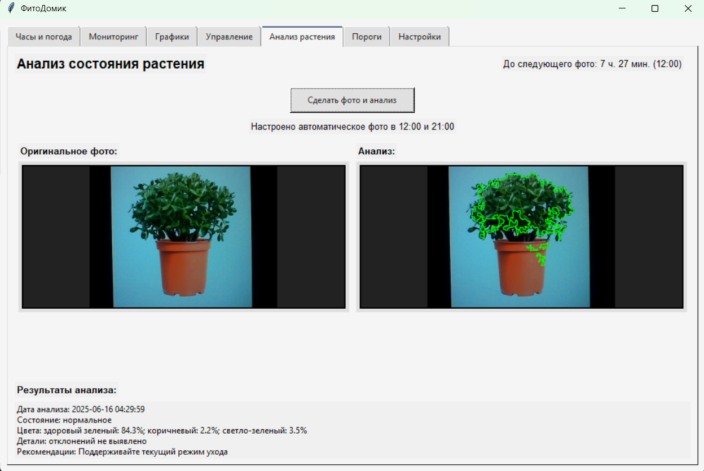
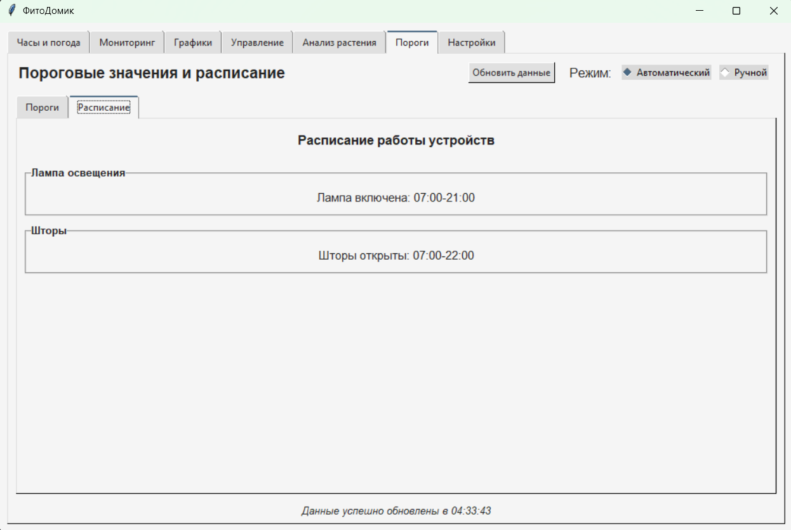
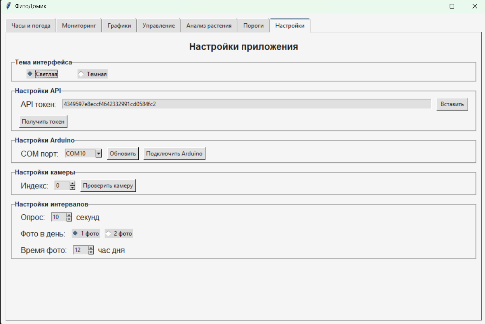

# 🌱 ФитоДомик



## 📋 О проекте

**ФитоДомик** — это умная система для автоматизации ухода за домашними растениями. Проект объединяет аппаратную часть на базе Arduino с программным обеспечением на Python для создания интеллектуальной теплицы, которая:

- Мониторит условия выращивания (влажность, температуру, освещенность)
- Автоматически управляет поливом, освещением, вентиляцией
- Анализирует состояние растений с помощью машиного зрения
- Предоставляет наглядную визуализацию данных и удобный интерфейс управления

Идеально подходит для любителей растений, которые хотят автоматизировать уход за своими зелеными питомцами и создать оптимальные условия для их роста.

## 📑 Содержание

1. [Структура проекта](#структура-проекта)
2. [Описание файлов](#описание-файлов)
3. [Архитектура проекта](#архитектура-проекта)
4. [Используемые библиотеки](#используемые-библиотеки)
5. [Ключевые архитектурные решения](#ключевые-архитектурные-решения)
6. [Диаграммы проекта](#диаграммы-проекта)
7. [Скриншоты интерфейса](#скриншоты-интерфейса)

## 📁 Структура проекта

```
ФитоДомик/
│
├── fitodomik.py       # Основной файл приложения
├── settings.json      # Файл с настройками приложения
├── README.md          # Документация проекта
├── fitodomik.exe      # Приложение exe
│
├── temp_humidity_light_2/       # Папка с кодом Arduino
│    └──temp_humidity_light_2    # Код для Arduino
│
├── foto/              # Директория с изображениями интерфейса
│   ├── screen1v1.png  # Скриншот экрана часы и погода
│   ├── screen2v1.png  # Скриншот экрана мониторинга
│   ├── screen3v1.png  # Скриншот экрана графиков
│   ├── screen4v1.png  # Скриншот экрана управления
│   ├── screen5v1.png  # Скриншот экрана анализа растения
│   ├── screen6v1.png  # Скриншот экрана порогов (автоматический режим)
│   ├── screen6v2.png  # Скриншот экрана порогов (ручной режим)
│   └── screen7v1.png  # Скриншот экрана настроек
│
└── fitodomilsvg/      # Директория с SVG-диаграммами проекта
    ├── structure.svg  # Диаграмма структуры проекта
    ├── dependencies.svg # Диаграмма зависимостей компонентов
    └── functions_used.svg # Диаграмма использования функций
```

## 📄 Описание файлов

### fitodomik.py

**Назначение**: Основной файл приложения, содержащий весь код системы "ФитоДомик".

**Основные классы**:

1. **PlantAnalyzer** - Класс для анализа состояния растений с помощью компьютерного зрения
   - Методы для захвата изображений с камеры
   - Методы для обнаружения растений и анализа их здоровья
   - Отправка данных анализа на сервер

2. **SensorHistory** - Класс для хранения истории показаний датчиков
   - Хранение временных рядов данных с датчиков
   - Ограничение максимального количества точек данных

3. **ArduinoHandler** - Класс для взаимодействия с Arduino через COM-порт
   - Подключение к Arduino
   - Получение данных с датчиков
   - Отправка команд управления устройствами

4. **DataSender** - Класс для отправки данных на сервер
   - Отправка показаний датчиков
   - Работа с API сервера

5. **ThresholdManager** - Класс для управления пороговыми значениями
   - Получение пороговых значений с сервера
   - Форматирование данных для отображения
   - Работа с расписанием

6. **FitoDomikApp** - Главный класс приложения
   - Инициализация интерфейса
   - Управление вкладками
   - Обработка пользовательского ввода
   - Управление настройками
   - Автоматический и ручной режимы работы

**Принцип работы**:
Файл реализует полнофункциональное приложение с графическим интерфейсом для мониторинга и управления системой "ФитоДомик". Приложение подключается к Arduino через COM-порт, получает данные с датчиков, отображает их в реальном времени, строит графики, анализирует состояние растений с помощью компьютерного зрения и отправляет данные на сервер. Также реализована возможность автоматического управления устройствами (лампой, шторами, насосом, вентилятором) на основе показаний датчиков и заданных пороговых значений.

### settings.json

**Назначение**: Хранение настроек приложения.

**Основные параметры**:
- Тема интерфейса
- API-токен для доступа к серверу
- COM-порт для подключения к Arduino
- Интервалы опроса датчиков и отправки данных
- Режимы управления и пороговых значений
- Настройки камеры и фотосъемки
- Пользовательские пороговые значения и расписания

## 🏗️ Архитектура проекта

Проект "ФитоДомик" построен на основе объектно-ориентированного подхода и имеет модульную архитектуру:

1. **Графический интерфейс** — Построен на Tkinter, разделен на функциональные вкладки
2. **Система мониторинга** — Получение и визуализация данных с датчиков
3. **Система управления** — Ручной и автоматический режимы работы устройств
4. **Система анализа растений** — Компьютерное зрение для оценки состояния растений
5. **Система работы с сервером** — Обмен данными с облачным сервисом
6. **Система настроек** — Управление параметрами работы приложения

## 📚 Используемые библиотеки

1. **Tkinter** — Графический интерфейс
2. **PySerial** — Работа с COM-портами
3. **Matplotlib** — Построение графиков
4. **NumPy** — Обработка данных
5. **PIL (Pillow)** — Работа с изображениями
6. **OpenCV (cv2)** — Компьютерное зрение
7. **Requests** — HTTP-запросы
8. **Стандартные библиотеки Python** — json, datetime, threading, os, re, io, collections.deque, webbrowser

## 🧩 Ключевые архитектурные решения

1. **Модульная архитектура** — Разделение функциональности на отдельные классы
2. **Многопоточность** — Параллельная работа мониторинга, анализа и управления
3. **Гибкие режимы работы** — Автоматический и ручной режимы управления
4. **Персистентность настроек** — Сохранение всех настроек в JSON-файл
5. **Компьютерное зрение** — Анализ состояния растений по изображениям
6. **Визуализация данных** — Интерактивные графики с историей показаний
7. **Интеграция с внешними системами** — Arduino, облачный сервер, API погоды

## 📊 Диаграммы проекта

### Структура проекта


### Диаграмма зависимостей компонентов


### Диаграмма использования функций


## 📱 Скриншоты интерфейса

### Экран 1: Часы и погода


### Экран 2: Мониторинг


### Экран 3: Графики


### Экран 4: Управление устройствами


### Экран 5: Анализ растения


### Экран 6: Пороги (автоматический режим)


### Экран 6: Пороги (ручной режим)


### Экран 7: Настройки

